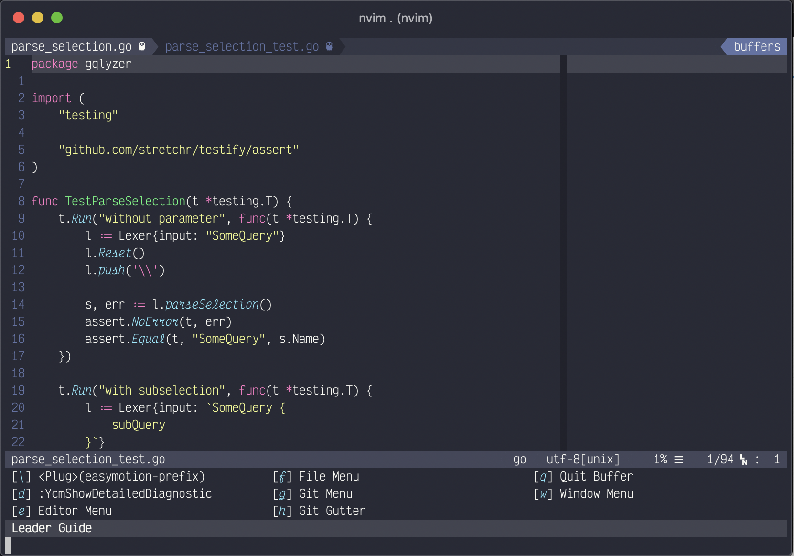
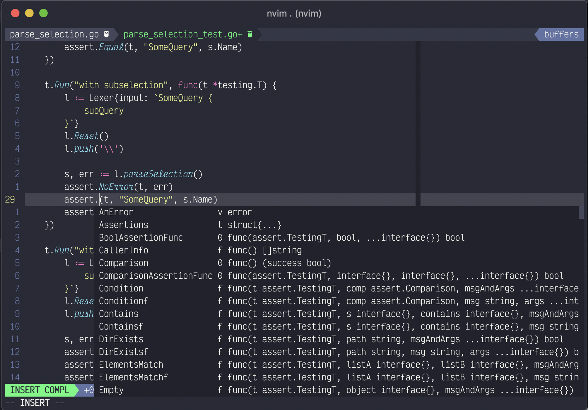
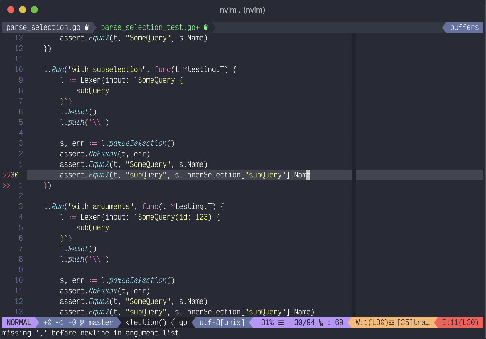
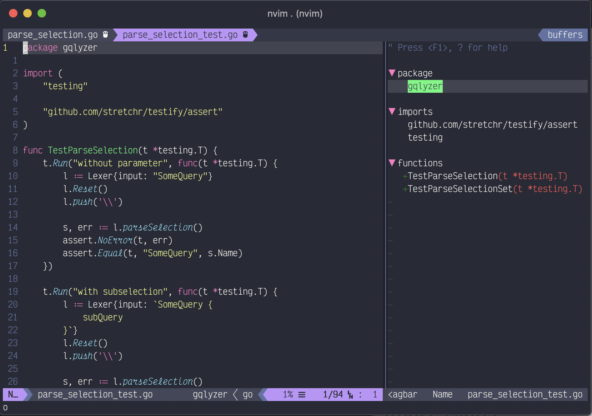
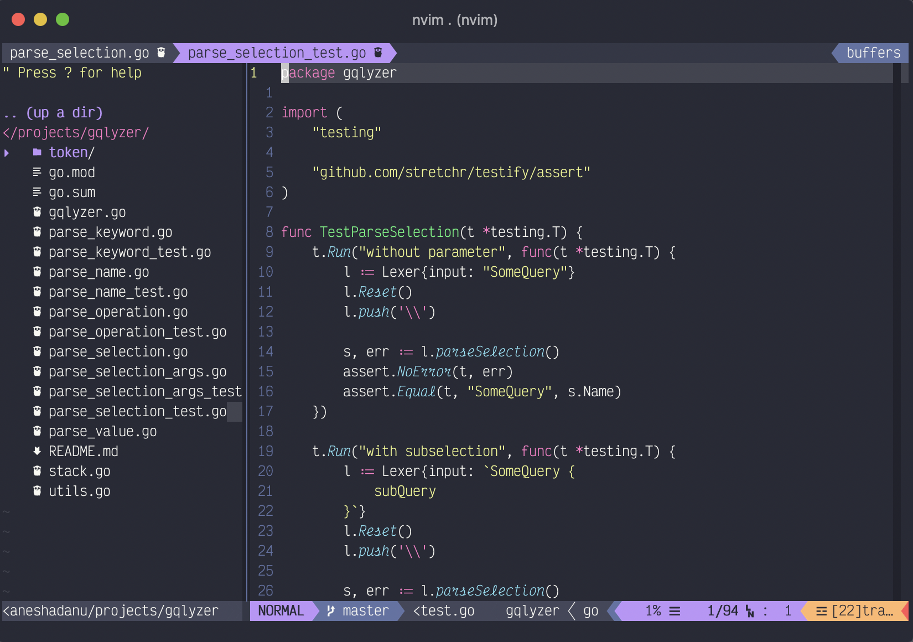

# Celebrimbor

vim distribution to get shit done

## Installation
1. Install https://neovim.io
2. Install neovim python client
3. clone/copy all `.vim` file into `~/.config/nvim` directory
4. open `init.vim` and run `:PlugInstall`
5. configure the rest
6.  you may need a powerline font
7.  (Optional) use `victor mono` font to get the same result as the screenshot

## Feature
here are a few notable feature you should know
### Leader Guide
forgot a keymap/shortcut, just press `/` (the default leader key)

### Code Suggestion
code completion using [YouCompleteMe](https://github.com/ycm-core/YouCompleteMe), you may need to config  ycm with yourlanguage

### Linting
code lingting using [ALE](https://github.com/dense-analysis/ale)

### Tagbar
to better understand the structure of the code, displaying ctag of the code using tagbar

### Nerdtree
browse your project tree with NERDTree

## And more
i suggest you to explore the vimscripts  especially the `plug.vim`, containing all the plugins being used, and/or try the `leader guide` to get started

